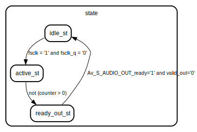

# Entity: FIR_Filter 
- **File**: fir_filter.vhdl
- **Title:**  FIR Filter (64-Tap, Avalon-ST Compatible)
- **File:**  FIR_Filter.vhd
- **Brief:**  Fully synchronous 64-tap FIR filter with runtime-updateable coefficients.

## Diagram

## Description

Implements a multiply-accumulate FIR structure running at 50 MHz.
The filter consumes audio samples from an Avalon-ST compatible source
(mono, 16 bit) and produces filtered samples for Avalon-ST sink logic.

**Interface Behavior**
- *Input (ADC → FIR)*
`Av_S_AUDIO_IN_valid` = 1 indicates a new sample
Filter asserts `Av_S_AUDIO_IN_ready` = 1 when ready to accept
Rising edge detection on `valid` triggers a full FIR compute cycle

- *Output (FIR → DAC)*
Output sample is provided on `Av_S_AUDIO_OUT` once per FIR run
`Av_S_AUDIO_OUT_valid` pulses for one cycle
Must coincide with `Av_S_AUDIO_OUT_ready` for downstream acceptance

**Coefficients**
- 64 coefficients (`FIR_type_coeffs`)
- Signed 16-bit values
- Updated asynchronously via UART (external logic)

**Timing**
- Complete FIR evaluation: 64 cycles
- Pipeline-free, MAC per clock cycle
- Suitable for <48 kHz audio stream

**States**
- `idle_st`: waits for rising edge on `valid`
- `active_st`: 64-cycle MAC computation
- `ready_out_st`: output handshake

**Notes**
- Bit growth: 16-bit input × 16-bit coeff → 32-bit accumulator
- Output truncated back to 16 bit (configurable)
- Internal delay line holds 64 samples

## Ports

| Port name            | Direction | Type                          | Description                   |
| -------------------- | --------- | ----------------------------- | ----------------------------- |
| clk                  | in        | std_logic                     | 50 MHz clock                  |
| rst                  | in        | std_logic                     | Active-high reset             |
| Av_S_AUDIO_IN        | in        | std_logic_vector(15 downto 0) | Incoming audio sample         |
| Av_S_AUDIO_IN_valid  | in        | std_logic                     | New sample available          |
| Av_S_AUDIO_IN_ready  | out       | std_logic                     | Filter ready flag             |
| Av_S_AUDIO_OUT       | out       | std_logic_vector(15 downto 0) | Filtered sample               |
| Av_S_AUDIO_OUT_valid | out       | std_logic                     | Output valid pulse            |
| Av_S_AUDIO_OUT_ready | in        | std_logic                     | Downstream ready              |
| FIR_Coeffs           | in        | FIR_type_coeffs               | 64×16-bit signed coefficients |

## Signals

| Name         | Type                                       | Description          |
| ------------ | ------------------------------------------ | -------------------- |
| delay_line_s | input_registers                            |                      |
| fsclk_q      | std_logic                                  | previous valid state |
| fsclk        | std_logic                                  | synchronized valid   |
| state        | state_machine                              |                      |
| counter      | integer range 0 to FILTER_TAPS-1           |                      |
| output       | signed(INPUT_WIDTH+COEFF_WIDTH-1 downto 0) |                      |
| accumulator  | signed(INPUT_WIDTH+COEFF_WIDTH-1 downto 0) |                      |
| data_i       | std_logic_vector(15 downto 0)              | input sample         |
| valid_out    | std_logic                                  | output valid         |
| debug        | std_ulogic                                 |                      |

## Constants

| Name         | Type                  | Value | Description |
| ------------ | --------------------- | ----- | ----------- |
| INPUT_WIDTH  | integer range 8 to 32 | 16    |             |
| COEFF_WIDTH  | integer range 8 to 32 | 16    |             |
| OUTPUT_WIDTH | integer range 8 to 32 | 16    |             |

## Types

| Name            | Type | Description |
| --------------- | ---- | ----------- |
| input_registers |      |             |

## Enums

### *state_machine*
| Name         | Description |
| ------------ | ----------- |
| idle_st      |             |
| active_st    |             |
| ready_out_st |             |

## Processes
- unnamed: ( clk )

## State machines

